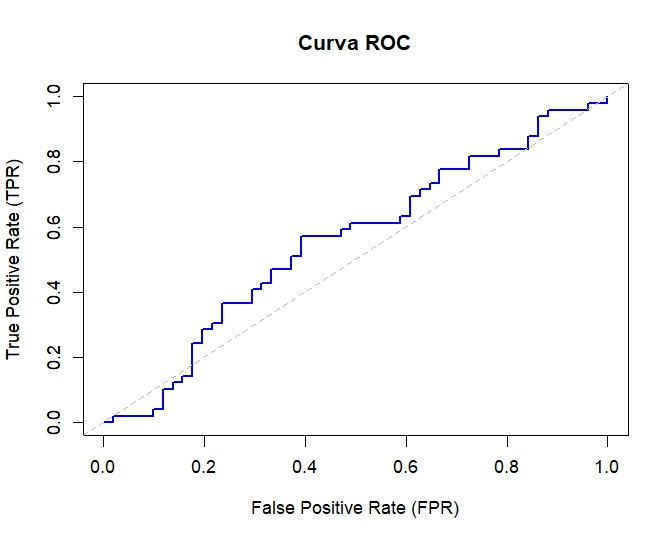
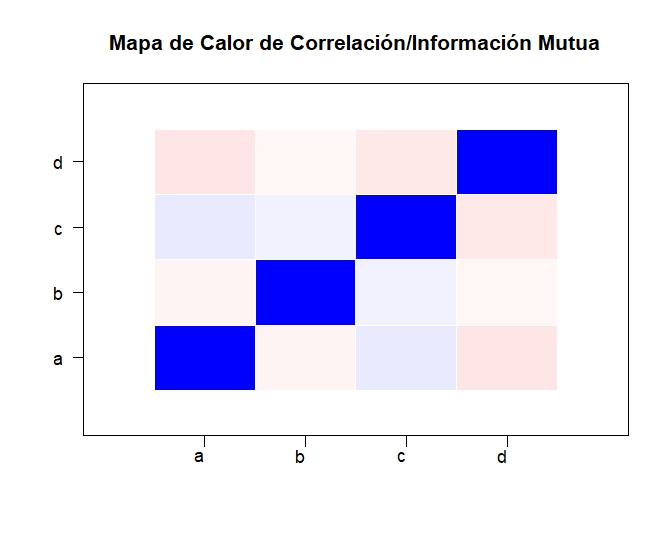

# Introducción

Este documento describe las funciones implementadas para el entregable de la asignatura de Software matemático y estadístico, así como ejemplos de uso. Las funciones para el entregable se dividen en 7 archivos: 5 archivos enumerados según los puntos requeridos en el entregable, y 2 archivos de ayuda que contienen funciones auxiliares. 
Los 5 ficheros principales son:

1. [Discretización](#disc): `1_discretize.R`
2. [Cálculo de Métricas](#metr): `2_metrics.R`
3. [Normalización y Estandarización](#norm): `3_normalize.R`
4. [Filtrado de Variables](#filtr): `4_filter.R`
5. [Cálculo de Correlación e Información Mutua](#corr): `5_correlation.R`
6. [Visualización (Curva ROC, Mapa de Calor de Correlación)](#plot): `6_plot.R`

Cada fichero lleva asociado un fichero `_test` con ejemplos de uso de cada función principal.

Los ficheros de ayuda son:

7. [Funciones matemáticas auxiliares](#math): `math.R`
8. [Funciones auxiliares de utilidad](#utils): `utils.R`

También estan disponibles los ficheros de ejemplo de uso de cada función, que se usarán en esta viñeta para explicar el uso de cada función principal.

---

# 1. Discretización {#disc}

### Introducción

**Enunciado**: Algoritmos de discretización para un solo atributo y para un dataset completo (ambas opciones): Igual frecuencia e igual anchura

Dentro del fichero `1_discretize.R` se encuentran las funciones para discretizar que pide el enunciado del entregable (`discretize_attribute` y `discretize_dataframe`) y las funciones auxiliares necesarias (`discretize` y `discretize_vector`).

### Métodos Implementados

#### discretize_attribute(df, column, num.bins, method)
Método para discretizar un atributo mediante los métodos "equal width" y "equal frecuency"

**Definición**
```r
# Parámetros:                                             						
#   df: (data.frame) data.frame que se desea discretizar.                       
#   column: (character) Nombre de la columna/atributo a discretizar.            
#   cuts: (numeric) Número de intervalos en los que se desea discretizar.		
#   method: (character) String que indica el método de discretización a utilizar:
#           "equal_width" para igual anchura o "equal_frequency" para igual frecuencia.
#                                                                                      
# Return: (list) Un objeto que contiene los valores discretizados y los puntos de corte.
discretice_attribute <- function(df, column, num.bins, method = "equal_width")
```
**Ejemplo de Uso**
```r
source("1_discretice.R")
# TEST VARIABLES
v1 <- c(11.5, 10.2, 1.2, 0.5, 5.3, 20.5, 8.4)
v2 <- c(11.5, 15, 1.2, 0.5, 5.3, 20.5, 8.4)
df <- data.frame(valor1 = v1, valor2 = v2)
k <- 4
test_width <- discretice_attribute(df,"valor1",k,"equal_width")
print(test_width)
#$valores
#[1] (10.5,15.5] (5.5,10.5]  (-Inf,5.5]  (-Inf,5.5]  (-Inf,5.5]  (15.5, Inf] (5.5,10.5] 
#Levels: (-Inf,5.5] (5.5,10.5] (10.5,15.5] (15.5, Inf]

#$puntos
#[1]  0.5  5.5 10.5 15.5 20.5

test_freq <- discretice_attribute(df,"valor1",k,"equal_frequency")
print(test_freq)
#$valores
#[1] (8.4,11.5]  (8.4,11.5]  (-Inf,1.2]  (-Inf,1.2]  (1.2,8.4]   (11.5, Inf] (1.2,8.4]  
#Levels: (-Inf,1.2] (1.2,8.4] (8.4,11.5] (11.5, Inf]

#$puntos
#[1]  0.5  1.2  8.4 11.5 20.5
```

#### discretize_dataframe(df, num.bins, method)
Método para discretizar un data.frame mediante los métodos "equal width" y "equal frecuency" 

**Definición**
```r
# Parámetros:
#   df: (data.frame) data.frame que se desea discretizar.
#   num.bins: (numeric) Número de intervalos en los que se desea discretizar.
#   method: (character) String que indica el método de discretización a utilizar:
#           "equal_width" para igual anchura o "equal_frequency" para igual frecuencia.
#
# Return: (data.frame) Mismo objeto de entrada con los atributos discretizados.
discretice_dataframe <- function(df, num.bins, method = "equal_width")
```
**Ejemplo de Uso**
```r
source("1_discretice.R")
# TEST VARIABLES
v1 <- c(11.5, 10.2, 1.2, 0.5, 5.3, 20.5, 8.4)
v2 <- c(11.5, 15, 1.2, 0.5, 5.3, 20.5, 8.4)
df <- data.frame(valor1 = v1, valor2 = v2)
k <- 4
test_width <- discretice_dataframe(df,k,"equal_width")
print(test_width)
#       valor1      valor2
#1 (10.5,15.5] (10.5,15.5]
#2  (5.5,10.5] (10.5,15.5]
#3  (-Inf,5.5]  (-Inf,5.5]
#4  (-Inf,5.5]  (-Inf,5.5]
#5  (-Inf,5.5]  (-Inf,5.5]
#6 (15.5, Inf] (15.5, Inf]
#7  (5.5,10.5]  (5.5,10.5]

test_freq <- discretice_dataframe(df,k,"equal_frequency")
print(test_freq)
#       valor1     valor2
#1  (8.4,11.5]   (8.4,15]
#2  (8.4,11.5]   (8.4,15]
#3  (-Inf,1.2] (-Inf,1.2]
#4  (-Inf,1.2] (-Inf,1.2]
#5   (1.2,8.4]  (1.2,8.4]
#6 (11.5, Inf]  (15, Inf]
#7   (1.2,8.4]  (1.2,8.4]
```

#### discretize_vector(x, cuts, method)
Método auxliar para discretizar vectores mediante los métodos "equal width" y "equal frecuency" 

**Definición**
```r
# Parámetros:                                                                             			    
#   x: (vector) Vector numérico que se desea discretizar.                                 			    
#   cuts: (numeric) Número de intervalos en los que se desea discretizar.				  			    
#   method: (character) String que indica el método de discretización a utilizar:         			    
#           "equal_width" para igual anchura o "equal_frequency" para igual frecuencia.   			    
#                                                                                         			    
# Return: (list) Un objeto que contiene los valores discretizados y los puntos de corte.  			    
discretice_vector <- function(x, cuts, method="equal_width")
```
**Ejemplo de Uso**
```r
source("1_discretice.R")
# TEST VARIABLES
v1 <- c(11.5, 10.2, 1.2, 0.5, 5.3, 20.5, 8.4)
v2 <- c(11.5, 15, 1.2, 0.5, 5.3, 20.5, 8.4)
k <- 4
test_width <- discretice_vector(v1,k,"equal_width")
print(test_width)
#$valores
#[1] (10.5,15.5] (5.5,10.5]  (-Inf,5.5]  (-Inf,5.5]  (-Inf,5.5]  (15.5, Inf] (5.5,10.5] 
#Levels: (-Inf,5.5] (5.5,10.5] (10.5,15.5] (15.5, Inf]

#$puntos
#[1]  0.5  5.5 10.5 15.5 20.5

test_freq <- discretice_vector(v1,k,"equal_frequency")
print(test_freq)
#$valores
#[1] (8.4,11.5]  (8.4,11.5]  (-Inf,1.2]  (-Inf,1.2]  (1.2,8.4]   (11.5, Inf] (1.2,8.4]  
#Levels: (-Inf,1.2] (1.2,8.4] (8.4,11.5] (11.5, Inf]

#$puntos
#[1]  0.5  1.2  8.4 11.5 20.5
```

#### discretize(x, cut.points)
Método auxiliar para generar tramos en un vector mediante los puntos de corte 

**Definición**
```r
# Parámetros:                                                                             
#   x: (vector) Vector numérico que se desea discretizar.                                 
#   cut.points: (vector) Vector numérico con los puntos de corte.						  
#                                                                                         
# Return: (list) Un objeto que contiene los valores discretizados y los puntos de corte.  		    
discretice <- function(x, cut.points)
```
**Ejemplo de Uso**
```r
# TEST VARIABLES
source("1_discretice.R")
v1 <- c(11.5, 10.2, 1.2, 0.5, 5.3, 20.5, 8.4)
v2 <- c(11.5, 0.5, 20.5)
test <- discretice(v1,v2)
print(test)
#$valores
#[1] (0.5, Inf] (0.5, Inf] (0.5, Inf] (-Inf,0.5] (0.5, Inf] (0.5, Inf] (0.5, Inf]
#Levels: (-Inf,0.5] (0.5, Inf]

#$puntos
#[1] 11.5  0.5 20.5
```

# 2. Cálculo de Métricas {#metr}

### Introducción

**Enunciado**: Cálculo de métricas para los atributos de un dataset: varianza y AUC para las variables contínuas y entropía para las discretas. La función deberá reconocer el tipo de atributo y actuar en consecuencia. Notese que en el caso del AUC, el dataset debe ser supervisado, es decir, es necesario especificar una variable clase binaria con la que evaluar el AUC de los atributos numéricos.

Dentro del fichero `2_metrics.R` se encuentran la función para el cálculo de métricas que pide el enunciado (`get_metricas`) y la función auxiliar necesaria para el cálculo de AUC( `calculate_auc`).

### Métodos Implementados

#### get_metricas(df, AUC_target)
Método para conseguir las métricas de varianza,entropia y UAC de un dataframe 

**Definición**
```r
# Parámetros:                                                                             				
#   df: (data.frame) data.frame para el que se desean generar métricas                       			
#   AUC_target: (data.frame) Si se desea calcular UAC para algún variable, hay que pasarle una variable 
#               con igual nombre para calcular el target                                                
#
# Return: (data.frame) Métricas para cada variable dependiendo de si es númerico discreto o no. 	          
get_metricas <- function(df, AUC_target = data.frame())
```
**Ejemplo de Uso**
```r
source("2_metrics.R")
# TEST VARIABLES
df <- data.frame(
  x = rnorm(100),
  y = rnorm(100),
  z = factor(sample(c("A", "B"), 100, replace = TRUE))
)
AUC_target <- data.frame(
  x = sample(c(0, 1), 100, replace = TRUE),
  y = sample(c(0, 1), 100, replace = TRUE)
)

#TEST get_metricas FUNCTION
metrics <- get_metricas(df, AUC_target = AUC_target)

# Ver resultados
print(metrics)
#$x
#$x$Varianza
#[1] 1.003877

#$x$AUC
#[1] 0.4746377


#$y
#$y$Varianza
#[1] 1.053417

#$y$AUC
#[1] 0.4977921


#$z
#$z$Entropia
#[1] 0.9814539
```

#### calculate_auc(predictions, target)
Método auxiliar para calcular el AUC de una variable 

**Definición**
```r
# Parámetros:                                                                             
#   predictions: (vector) Vector numérico en el que se desea calcular el AUC.             
#   target: (vector) target para el calculo supervisado.    						                  
#                                                                                         
#
# Return: (list) list con AUC=valor AUC, TPR=positive rate y FPR=negative rate.                    
calculate_auc <- function(predictions, target)
```
**Ejemplo de Uso**
```r
source("2_metrics.R")
# TEST VARIABLES
v <- rnorm(100)
target <- sample(c(0, 1), 100, replace = TRUE)

#TEST get_metricas FUNCTION
auc_data <- calculate_auc(v, target)

# Ver resultados
print(auc_data)
#$AUC
#[1] 0.5961538

#$TPR
#  [1] 0.00000000 0.00000000 0.01923077 0.03846154 0.05769231 0.05769231 0.05769231 0.05769231 0.07692308 0.09615385 0.11538462
# [12] 0.11538462 0.11538462 0.13461538 0.15384615 0.15384615 0.15384615 0.15384615 0.17307692 0.19230769 0.19230769 0.21153846
# [23] 0.23076923 0.23076923 0.23076923 0.25000000 0.26923077 0.26923077 0.26923077 0.28846154 0.30769231 0.32692308 0.34615385
# [34] 0.36538462 0.38461538 0.40384615 0.42307692 0.42307692 0.42307692 0.44230769 0.46153846 0.48076923 0.48076923 0.48076923
# [45] 0.50000000 0.51923077 0.53846154 0.55769231 0.55769231 0.57692308 0.57692308 0.59615385 0.59615385 0.59615385 0.61538462
# [56] 0.61538462 0.63461538 0.63461538 0.65384615 0.65384615 0.67307692 0.69230769 0.71153846 0.73076923 0.75000000 0.76923077
# [67] 0.76923077 0.76923077 0.78846154 0.78846154 0.80769231 0.80769231 0.82692308 0.84615385 0.84615385 0.84615385 0.84615385
# [78] 0.86538462 0.88461538 0.88461538 0.90384615 0.90384615 0.90384615 0.90384615 0.90384615 0.90384615 0.90384615 0.90384615
# [89] 0.90384615 0.92307692 0.92307692 0.94230769 0.94230769 0.94230769 0.94230769 0.96153846 0.98076923 0.98076923 1.00000000
#[100] 1.00000000 1.00000000

#$FPR
#  [1] 0.00000000 0.02083333 0.02083333 0.02083333 0.02083333 0.04166667 0.06250000 0.08333333 0.08333333 0.08333333 0.08333333
# [12] 0.10416667 0.12500000 0.12500000 0.12500000 0.14583333 0.16666667 0.18750000 0.18750000 0.18750000 0.20833333 0.20833333
# [23] 0.20833333 0.22916667 0.25000000 0.25000000 0.25000000 0.27083333 0.29166667 0.29166667 0.29166667 0.29166667 0.29166667
# [34] 0.29166667 0.29166667 0.29166667 0.29166667 0.31250000 0.33333333 0.33333333 0.33333333 0.33333333 0.35416667 0.37500000
# [45] 0.37500000 0.37500000 0.37500000 0.37500000 0.39583333 0.39583333 0.41666667 0.41666667 0.43750000 0.45833333 0.45833333
# [56] 0.47916667 0.47916667 0.50000000 0.50000000 0.52083333 0.52083333 0.52083333 0.52083333 0.52083333 0.52083333 0.52083333
# [67] 0.54166667 0.56250000 0.56250000 0.58333333 0.58333333 0.60416667 0.60416667 0.60416667 0.62500000 0.64583333 0.66666667
# [78] 0.66666667 0.66666667 0.68750000 0.68750000 0.70833333 0.72916667 0.75000000 0.77083333 0.79166667 0.81250000 0.83333333
# [89] 0.85416667 0.85416667 0.87500000 0.87500000 0.89583333 0.91666667 0.93750000 0.93750000 0.93750000 0.95833333 0.95833333
#[100] 0.97916667 1.00000000
```

# 3. Normalización y Estandarización {#norm}

### Introducción

**Enunciado**: Normalización y estandarización de variables, tanto de manera individual como para el dataset completo. Esto solo debe ser aplicado a atributos que sean numéricos.

Dentro del fichero `3_normalize.R` se encuentran las funciones para normalizar y estandarizar que pide el enunciado (`normalize` y `standardize`).

### Métodos Implementados

#### normalize(df)
Método para normalizar un dataframe 

**Definición**
```r
# Parámetros:                                                                             				      
#   df: (data.frame) data.frame para normalizar    
#                                          				    
# Return: (data.frame) data.frame normalizado. Solo normaliza columnas numéricas.                	                       
normalize <- function(df)
```
**Ejemplo de Uso**
```r
source("3_normalize.R")
# TEST VARIABLES
df <- data.frame(
  x=c(10, 20, 30, 40, 50),
  y=c(5, 5, 5, 5, 5)
)

#TEST normalize FUNCTION
n <- normalize(df)

# Imprimir resultados
print("Valores originales:")
#[1] "Valores originales:"
print(df)
#   x y
#1 10 5
#2 20 5
#3 30 5
#5 50 5
4 40 5

print("Valores normalizados:")
#[1] "Valores normalizados:"
print(n)
#     x y
#1 0.00 0
#2 0.25 0
#3 0.50 0
#4 0.75 0
#5 1.00 0
```

#### standardize(df)
Método para estandarizar un dataframe 

**Definición**
```r
# Parámetros:                                                                             				      
#   df: (data.frame) data.frame para estandarizar
#  				    
# Return: (data.frame) data.frame estandarizado. Solo estandariza columnas numéricas.            	        	                       
standardize <- function(df)
```
**Ejemplo de Uso**
```r
source("3_normalize.R")
# TEST VARIABLES
df <- data.frame(
  x=c(10, 20, 30, 40, 50),
  y=c(5, 5, 5, 5, 5)
)

#TEST standardize FUNCTION
n <- standardize(df)

# Imprimir resultados
print("Valores originales:")
#[1] "Valores originales:"
print(df)
#   x y
#1 10 5
#2 20 5
#3 30 5
#4 40 5
#5 50 5

print("Valores estandarizados:")
# [1] "Valores estandarizados:"
print(n)
#           x y
#1 -1.2649111 0
#2 -0.6324555 0
#3  0.0000000 0
#4  0.6324555 0
#5  1.2649111 0
```

# 4. Filtrado de Variables {#filtr}

### Introducción

**Enunciado**: Filtrado de variables en base a las métricas implementadas. Es decir, partiendo de un dataset, obtener uno nuevo donde todas las variables cumplan los requisitos indicado (por ejemplo, una entropía superior a un cierto umbral).

Dentro del fichero `4_filter.R` se encuentra la función para filtrar un dataset que pide el enunciado (`filter_by_entropy`). Se ha seleccionado el filtrado por entropía mínima como ejemplo de filtrado, pero se podrían implementar filtros con otras métricas.

### Métodos Implementados

#### filter_by_entropy(df, threshold)
Método para filtar un data.frame en base a un threshold de entropia

**Definición**
```r
# Parámetros:                                                                             				      
#   df: (data.frame) data.frame para filtar                                                 				    
#   threshold: (numeric) Threshold para filtar por entropia                                  				    
#
# Return: (data.frame) data.frame filtrado, eliminando las variables que no hayan superado el threshold.        	        	                       
filter_by_entropy <- function( df, threshold )
```
**Ejemplo de Uso**
```r
source("4_filter.R")
# TEST VARIABLES
df_test <- data.frame(
  categoria1 = factor(c("A", "A", "B", "A", "B", "B")),
  categoria2 = factor(c("X", "X", "X", "X", "X", "X")),  # Entropía baja
  valores = c(10, 20, 30, 40, 50, 60),
  texto = c("uno", "dos", "tres", "uno", "dos", "tres")
)
threshold <- 0.0001

# Filtrar columnas con entropía muy baja, rondando el 0
df_filtered <- filter_by_entropy(df_test, threshold)

# Imprimir resultado
print("Dataset original:")
# [1] "Dataset original:"
print(df_test)
#  categoria1 categoria2 valores texto
#1          A          X      10   uno
#2          A          X      20   dos
#3          B          X      30  tres
#4          A          X      40   uno
#5          B          X      50   dos
#6          B          X      60  tres

print("Dataset filtrado por entropía:")
#[1] "Dataset filtrado por entropía:"
print(df_filtered)
#  categoria1 valores texto
#1          A      10   uno
#2          A      20   dos
#3          B      30  tres
#4          A      40   uno
#5          B      50   dos
#6          B      60  tres
```

# 5. Cálculo de Correlación e Información Mutua {#corr}

### Introducción

**Enunciado**: Cálculo de la correlación (información mutua en el caso de variables categóricas) por pares entre variables de un dataset. La función deberá considerar de qué tipo es cada variable.

Dentro del fichero `5_correlation.R` se encuentra la función para calcular la correlación e información mutua que pide el enunciado (`get_correlation`).

### Métodos Implementados

#### get_correlation(df, max_values)
Método para calcular la correlación en un data.frame en base al tipo de variable 

**Definición**
```r
# Parámetros:                                                                             				      
#   df: (data.frame) data.frame para correlacionar                                           				    
#   max_values: (numeric) cantidad máxima de opciones únicas de un factor a tener en cuenta para ser    
#                         considerado como variable categórica                                          
#
# Return: (matrix) matriz de correlaciones                                                                  	        	                       
get_correlation <- function(df, max_values = 5)
```
**Ejemplo de Uso**
```r
source("5_correlation.R")
# TEST VARIABLES
df <- data.frame(
  x = rnorm(100),
  y = rnorm(100),
  a = factor(sample(letters[1:3], 100, replace = TRUE)),
  b = factor(sample(letters[1:3], 100, replace = TRUE))
)

# Calcular correlación
results <- get_correlation(df)

# Imprimir resultados
print(results)
#           x          y          a          b
#x  1.0000000 -0.1067227         NA         NA
#y -0.1067227  1.0000000         NA         NA
#a         NA         NA 1.56323326 0.02445552
#b         NA         NA 0.02445552 1.58268319
```

# 6. Visualización {#plot}

### Introducción

**Enunciado**: Plots para el AUC y para las matrices de correlación/información mutua.

Dentro del fichero `6_plot.R` se encuentran las funciones para visualizar que pide el enunciado (`calculate_plot_auc` y `plot_correlation_heatmap`). hacen uso de las funciones implementadas en el punto 2 y 5.

### Métodos Implementados

#### calculate_plot_auc(variable, target)
Método para mostrar el plot del AUC de una variable 

**Definición**
```r
# Parámetros:                                                                             
#   variable: (vector) Vector numérico en el que se desea calcular el AUC.                
#   target: (vector) target para el calculo supervisado.
calculate_plot_auc <- function(variable, target)
```
**Ejemplo de Uso**
```r
source("6_plot.R")
# TEST VARIABLES
v <- rnorm(100)
target <- sample(c(0, 1), 100, replace = TRUE)

# Ver resultados
calculate_plot_auc(v, target)
```


#### plot_correlation_heatmap(df)
Método para mostrar el plot de una matriz de correlación

**Definición**
```r
# Parámetros:
#   df: (data.frame) data.frame para el cálculo de la matriz de correlación.              
plot_correlation_heatmap <- function(df)
```
**Ejemplo de Uso**
```r
source("6_plot.R")
# TEST VARIABLES
df <- data.frame(
  a = rnorm(100),
  b = rnorm(100),
  c = rnorm(100),
  d = rnorm(100)
)

# Ver resultados
plot_correlation_heatmap(df)
```


# 7. Funciones matemáticas auxiliares {#math}

### Introducción
 Se han implementado varias funciones auxiliares para el cálculo de operaciones matemáticas necesarias a lo largo de todo el entregable. Estas funciones se encuentran en el fichero `math.R`. Son funciones que se pueden encontrar en otras librerías de R, pero se han implementado para tener un mayor control sobre el código y para evitar dependencias externas.

### Métodos Implementados

#### get_entropia(fact)
Función auxiliar para calcular la entropía

**Definición**
```r
# Parámetros:                                                                             
#   fact: (factor) variable para el cálculo de la entropía.
get_entropia <- function(fact)
```

#### get_varianza(x)
Función auxiliar para calcular la varianza

**Definición**
```r
# Parámetros:                                                                             
#   x: (numeric) variable para el cálculo de la varianza.
get_varianza <- function(x)
```

#### normalize_variable(x)
Función auxiliar para normalizar valores

**Definición**
```r
# Parámetros:                                                                             
#   x: (numeric) variable para la normalización
normalize_variable <- function(x)
```

#### standardize_variable(x)
Función auxiliar para estandarizar valores

**Definición**
```r
# Parámetros:                                                                             
#   x: (numeric) variable para la estandarización
standardize_variable <- function(x)
```

#### media_variable(x)
Función auxiliar para sacar la media

**Definición**
```r
# Parámetros:                                                                             
#   x: (numeric) variable con la cual calcular la media
media_variable <- function(x)
```

#### sd_variable(x)
Función auxiliar para sacar la desviación estandard

**Definición**
```r
# Parámetros:                                                                             
#   x: (numeric) variable con la cual calcular la desviación estandard
sd_variable <- function(x)
```

#### get_pearson_cor(x,y)
Función auxiliar para calcular la correlación de pearson entre dos variables numéricas

**Definición**
```r
# Parámetros:                                                                             
#   x: (numeric) primera variable numérica para el cáculo de la correlación
#   y: (numeric) segunda variable numérica para el cáculo de la correlación
get_pearson_cor <- function(x,y)
```

#### get_mutual_information_cor(x,y)
Función auxiliar para calcular la información mutua entre dos variables categóricas

**Definición**
```r
# Parámetros:                                                                             
#   x: (factor) primera variable categórica para el cáculo de la correlación mediante información mutua
#   y: (factor) segunda variable categórica para el cáculo de la correlación mediante información mutua
get_mutual_information_cor <- function(x,y)
```
# 8. Funciones auxiliares de utilidad {#utils}

### Introducción
Además de las funciones necesarias para la implementación de los puntos requeridos en el entregable y las funciones matemáticas necesarias, se han implemetnado algunas funciones auxiliares de utilidad que se encuentran en el fichero `utils.R`. Estas funciones ayudan a la implementación de tareas comunes durante el desarrollo del código.

### Métodos Implementados

#### clean_console()
Función auxiliar para limpiar la consola
```r
clean_console <- function() 
```
#### clean_env()
Función auxiliar para limpiar el entorno. NOTA: Para un desarrollo más cómodo, no limpia las funciones del entorno
```r
clean_env <- function() 
```
#### clean()
Función auxiliar para limpiar tanto la consola como el entorno
```r
clean <- function() 
```

#### readFile(filePath)
Función auxiliar para leer ficheros, con separador ";" y quote "\"
```r
# Parámetros:
#  filePath: (character) Ruta del fichero a leer
readFile <- function(filePath)
```
#### readFilesFromFolder(folder)
Función auxiliar para leer todos los ficheros de una carpeta, con separador ";" y quote "\"
```r
# Parámetros:
#  folder: (character) Ruta de la carpeta a leer
readFilesFromFolder <- function(folder)
```

#### setwd(path)

Aunque no se haya implementado esta función, sí se ha hecho uso de la misma para poner el contexto de trabajo en el directorio donde se ejecute el script, mediante el siguiente comando:
```r
setwd(dirname(rstudioapi::getSourceEditorContext()$path))
```